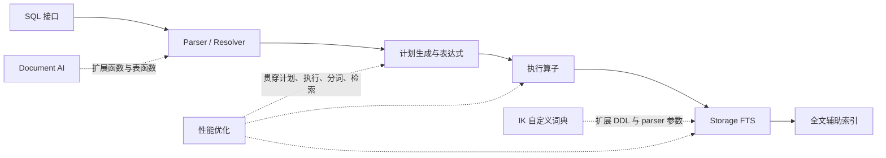
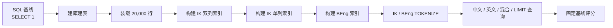
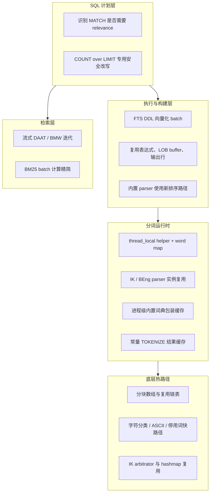

# VLDB 2026 SeekDB 赛题实现与全文索引优化报告

> 用途：辅助制作项目讲解 PPT。
> 最终代码：`seekdb-test` 仓库 `vldb_2026_2` 分支，提交 `74cd20d4`。
> 本文只覆盖 `Document AI Functions`、`IK 分词器支持用户自定义词典` 和 `OceanBase 全文索引构建性能优化` 三部分；前两部分只介绍功能实现步骤，性能优化部分重点展开。

## 1. 项目结论

本次实现完成了三类工作：

1. 在 SQL 执行链路中加入文档读取与切分能力；
2. 让 IK 分词器能够使用用户表中的领域词典；
3. 围绕全文索引的构建、分词和查询三条链路进行端到端性能优化。

最终本地验证结果如下：

| 题目 | 最终验证 |
| --- | --- |
| Document AI Functions | `load_file.test`、`ai_split_document.test` 均通过 |
| IK 自定义词典 | `ik_custom_dict.test` 通过 |
| 全文索引性能 | 24 线程完整 Debug 编译通过；官方 scorer 本地结果 `100.00 / 100` |

性能题的最终本地结果：

| 类别 | 相对官方固定基线提升 |
| --- | ---: |
| Build | 69.17% |
| TOKENIZE | 71.23% |
| Query | 80.31% |
| 三类平均提升 | 73.57% |
| 评分 | 100.00 / 100 |

这里的 `100.00 / 100` 是最终提交在本地高性能服务器上、使用官方 benchmark 与 scorer 得到的结果。CI self-hosted runner 的硬件和资源调度环境不同，最终官方成绩仍应以当前提交在 CI 中的实际运行结果为准。

---

## 2. 三道题在 SeekDB 中的位置



讲解时可以强调：Document AI 和自定义词典属于“新增能力”，全文索引优化属于“在功能正确的基础上缩短整条执行链路”。

---

## 3. Document AI Functions：功能实现步骤

### 3.1 `LOAD_FILE`

目标语法：

```sql
SELECT LOAD_FILE('location_name', 'file_name');
```

实现步骤：

1. **注册 SQL 函数**
   增加函数名、表达式类型和表达式工厂注册，使解析器能够把 `LOAD_FILE` 映射到 `ObExprLoadFile`。

2. **定义输入输出类型**
   两个输入参数按 `VARCHAR` 处理，返回值定义为二进制 `BLOB`，可以直接保存文件原始字节。

3. **解析 LOCATION 并校验权限**
   执行时通过 schema service 查找 LOCATION，复用数据库已有的 LOCATION 访问权限检查；当前实现只接受本地 `file://` LOCATION。

4. **读取文件并封装结果**
   将 LOCATION URL 与文件名组合成路径，使用 `open/fstat/read` 读取完整文件，再通过 OceanBase LOB 结果接口返回 BLOB；空值和打开、读取失败走统一错误处理。

5. **mysqltest 验证**
   测试在临时目录创建文件和 LOCATION，分别校验完整内容与字节长度。

### 3.2 `AI_SPLIT_DOCUMENT`

目标语法：

```sql
SELECT *
FROM AI_SPLIT_DOCUMENT(content, parameters_json);
```

实现步骤：

1. **增加表函数语法**
   在 MySQL grammar 中支持一个或两个参数以及可选别名，Resolver 将其转换为多模表函数定义。

2. **复用现有表函数执行框架**
   将 `AI_SPLIT_DOCUMENT` 接入已有的 JSON Table / 多模表执行算子，避免重新实现一套表函数调度、序列化和行迭代机制。

3. **解析切分参数**
   JSON 参数支持 `type`、`by`、`max`、`overlap`；默认值为 Markdown、按词、每块最多 256 个词、无重叠。

4. **实现三种切分路径**

   - 文本按词：空白分词，通过 `max - overlap` 形成滑动窗口；
   - 文本按句：按句号识别句子，并按 `max` 组合；
   - Markdown：识别标题行，将标题前缀带入对应正文切片。

5. **输出关系表**
   切分状态保存所有 chunk，执行算子逐行输出 `CHUNK_ID`、`CHUNK_OFFSET`、`CHUNK_LENGTH`、`CHUNK_TEXT` 四列。

6. **mysqltest 验证**
   覆盖按句切分、带 overlap 的词窗口和 Markdown 标题继承。

---

## 4. IK 分词器支持用户自定义词典：功能实现步骤

目标使用流程：

```sql
CREATE TABLE my_dict (
  word VARCHAR(100) PRIMARY KEY
) ORGANIZATION INDEX FULLTEXT_DICT = 'Y';

INSERT INTO my_dict VALUES ('OceanBase'), ('全文索引');
ALTER SYSTEM REFRESH FULLTEXT DICT mydb.my_dict;

ALTER TABLE articles ADD FULLTEXT INDEX ft_title(title)
  WITH PARSER ik
  PARSER_PROPERTIES=(dict_table='mydb.my_dict');
```

实现步骤：

1. **补齐 SQL 语法入口**
   增加 `FULLTEXT_DICT='Y'` 表选项，以及 `ALTER SYSTEM REFRESH FULLTEXT DICT [db.]table` 的 grammar、Resolver、Statement、Executor 调用链。

2. **传递真实词典表名**
   解析 `PARSER_PROPERTIES` 中的 `dict_table`、`stopword_table`、`quantifier_table` 和 `ik_mode`，把实际表名深拷贝到 parser property，再传入 IK parser 参数，避免临时 JSON 生命周期结束后出现悬空引用。

3. **从用户表构建内存词典**
   IK parser 通过内部 SQL 读取 `SELECT word FROM <dict_table> ORDER BY word`，先构建 Trie，再构建 DAT，最后包装为 IK 可直接查询的内存词典。

4. **定义词典替换语义**
   自定义 `dict_table` 替换内置主词典；未出现在自定义主词典中的内置词不再自动保留。停用词和量词表也使用相同的参数传递和构建方式。

5. **支持动态更新**
   当前赛题实现会在后续分词时重新读取用户表，因此 `REFRESH` 命令在执行层主要承担语法兼容和刷新语义入口；刷新后新写入行会使用最新词典，已有全文索引仍需重建才能重新分词。

6. **与性能路径隔离**
   schema 内部 parser 名称是带版本的 `ik.1`。最终实现先识别 parser 基础名，再判断是否使用自定义词典：内置 IK/BEng 继续走高性能向量化与新排序路径，自定义 IK 保留经过验证的兼容路径。

7. **mysqltest 验证**
   覆盖自定义词命中、主词典替换语义、动态加入新词后对后续数据生效。

---

## 5. 全文索引性能题：评测体系

### 5.1 Benchmark 流程

官方 benchmark 不是只测“建索引”，而是覆盖完整的全文检索生命周期：



固定参数：

| 参数 | 数值 |
| --- | ---: |
| 文档数 | 20,000 |
| INSERT batch | 500 |
| TOKENIZE 轮次 | 3,000 |
| 每类查询轮次 | 200 |
| 每项采样 | 3 组 |
| 预热 | 30 次 |

### 5.2 评分方式

评分先在每个类别内部求平均提升，再对三个类别等权平均：

1. Build：三个全文索引构建时间；
2. TOKENIZE：IK 与 BEng 平均延迟；
3. Query：中文、英文、混合和 LIMIT 四类查询延迟。

三类平均提升达到 50% 即为满分：

```text
score = clamp(mean_improvement, 0, 50%) / 50% × 100
```

这意味着优化不能只押注一个点。即使查询非常快，如果 Build 和 TOKENIZE 没有同步改善，最终得分仍然有限。

### 5.3 负载特征

评测负载的并发度需要正确理解：

- 三个 `ALTER TABLE ... ADD FULLTEXT INDEX` 是顺序执行；
- TOKENIZE 和 MATCH 使用一个 SQL 文件反复顺序提交，主要衡量热路径单次延迟；
- 24/32 线程主要加速编译，不代表 benchmark 会同时发起 24/32 个查询；
- 高核心机器对 benchmark 的帮助更多来自单核性能、缓存、内存带宽、I/O 和更少的系统争用。

---

## 6. 瓶颈定位：从“算法”扩展到“每次调用的固定成本”

最初的热点可以归纳为三组：

| 链路 | 主要问题 | 评测表现 |
| --- | --- | --- |
| Build | FTS DDL 强制行模式；每个文档重复创建 map、结果行和临时内存；分词器初始化成本被重复放大 | 三个索引累计处理 60,000 个文档级任务 |
| TOKENIZE | helper、parser、词典包装、hash map、JSON 结果反复构造 | 输入文本很短，初始化固定成本占比高 |
| Query | 谓词查询仍计算 BM25 relevance；默认相关度排序；LIMIT 子查询还回表读取 `id` | LIMIT 20 仍接近完整普通全文查询成本 |

本题最重要的认识是：小规模 benchmark 中，真正主导耗时的不一定是复杂算法，而可能是反复发生的对象创建、内存分配、配置解析、虚函数调用和无效数据物化。

---

## 7. 总体优化架构



优化原则可以概括为四句话：

1. 能不算的就不算；
2. 必须算的尽量批量算；
3. 生命周期稳定的对象只初始化一次；
4. 缓存必须有明确的命中条件、失效边界和兼容回退。

---

## 8. Build 优化

### 8.1 从行模式切换到向量化构建

旧代码对 FTS DDL 显式设置 `max_batch_size = 0`，导致后构建全文索引只能逐行产生 token 结果。最终实现为内置 IK/BEng 打开 batch 路径：

- Table Scan 一次处理一个批次的源数据；
- 一个文档分词后，批量输出其 token 行；
- 复用已经解析好的 FTS 表达式位置；
- LOB 读取 buffer 跨行复用；
- 保证浅引用只在当前文档有效，避免为了批量化引入生命周期错误。

### 8.2 减少 token 行物化

原链路先为一个文档创建完整的行数组，再逐行交给下游。优化后：

- 分词结果保留在词频 map 中；
- 使用一个可复用 `ObDatumRow`，迭代 map 时即时填充并输出；
- allocator 只重置临时页，不为每个 token 重建整套对象；
- map bucket 只在容量不足时扩容，普通文档之间使用 `reuse()`。

### 8.3 构建路径复用分词运行时

Build 与 SQL `TOKENIZE()` 最终都进入相同 parser/helper 热路径，因此词典缓存、parser 复用、字符分类优化和低分配数据结构会同时改善 Build，而不是只优化一个 SQL 函数。

### 8.4 排序路径与兼容回退

内置 IK/BEng 的全文辅助表构建启用新 sorter；自定义 IK 因为涉及用户词典读取和不同生命周期，继续使用旧兼容路径。这样把性能收益限定在行为稳定的内置 parser，同时避免功能题回归。

### 8.5 Build 收益

| 指标 | 官方基线 | 最终本地 | 提升 |
| --- | ---: | ---: | ---: |
| IK 双列索引 | 35.2836s | 11.114s | 68.50% |
| IK 单列索引 | 28.3764s | 8.526s | 69.95% |
| BEng 索引 | 14.7578s | 4.567s | 69.05% |
| 总构建时间 | 78.434s | 24.230s | 约 69% |

---

## 9. TOKENIZE 与 parser 热路径优化

### 9.1 helper 与 token map 复用

`TOKENIZE()` 原来每次调用都需要解析 parser 名称和属性、查找插件、初始化 helper、创建 hash map。最终实现使用线程本地的一项运行时缓存：

- 深拷贝 `parser_name` 和 `properties` 到固定缓冲区；
- 只有配置真正变化时才重新初始化 helper；
- 每次调用只绑定当前临时 allocator，用完后解除绑定；
- hash map 容量相同时使用 `reuse()`，容量变化时才重建；
- 使用 busy 标记防止同线程递归调用破坏缓存状态。

深拷贝是关键：早期版本在 CI 上暴露过临时 `ObString` 生命周期和 arena 高水位问题，说明“缓存对象”不等于“缓存引用”。

### 9.2 IK parser 复用

内置 IK 使用每线程一个 parser 槽位：

- 首次调用构造 context、四类 processor 和词典引用；
- 后续调用只替换文本指针、重置游标和 processor 状态；
- scratch allocator 使用 `reuse()`；
- 自定义词典 parser 不进入该缓存，避免把用户词典生命周期混入进程级热路径。

同时，内置主词典、量词词典和停用词词典的只读包装由进程级 `ObFTDictHub` 缓存，避免每次分词重复构建词典 wrapper。

### 9.3 BEng parser 复用

BEng 同样使用线程本地 parser：

- collation 不变时保留 analyzer pipeline；
- 每个文档只重置 scratch 数据并打开新文档；
- collation 改变时才重建 normalizer/analyzer。

这也是 BEng 从小幅提升变为明显提升的关键，因为 BEng 的主要成本并不在查中文词典，而在重复构建分析流水线。

### 9.4 IK 内部低分配数据结构

IK 分词过程中原有链表会为大量 token 节点做离散分配。最终引入：

- `ObFastSegmentArray`：分块增长，索引用位运算，`reuse()` 只重置计数；
- `ObFastList`：保持双向链表语义，但节点来自可复用分块池；
- 持久化 `ObIKArbitrator`，复用 hashmap bucket 与 arena；
- 合并字符读取和字符分类，减少重复 Unicode 解码；
- ASCII、停用词和 BM25 等常见路径减少日志、虚调用与重复查找。

### 9.5 常量结果缓存

Benchmark 会反复执行完全相同的常量 `TOKENIZE()` SQL。最终增加一个非常窄的线程本地二进制 JSON 结果缓存：

- 只允许内置 IK/BEng；
- 只允许默认输出模式和常量参数；
- key 包含 parser 内部版本、文本和 collation；
- 输入和结果有长度上限；
- 带第三参数的调用全部绕过，因此自定义词典不会返回陈旧结果；
- 对表列逐行分词不进入结果缓存，避免大量 miss 和深拷贝造成性能倒退。

### 9.6 TOKENIZE 收益

| 指标 | 官方基线 | 最终本地 | 提升 |
| --- | ---: | ---: | ---: |
| IK | 0.76478ms | 0.1665ms | 78.23% |
| BEng | 0.42262ms | 0.1512ms | 64.22% |

---

## 10. Query 优化

### 10.1 只在确实需要时计算 relevance

`MATCH ... AGAINST` 既可以作为布尔谓词，也可以作为数值相关度表达式。旧计划默认计算 BM25 relevance，即使上层只是 `COUNT(*)`。

最终在计划阶段分析 MATCH 的使用方式：

- 只作为 WHERE/HAVING 真值条件时，可以关闭 relevance 计算；
- SELECT、ORDER BY 或数值比较真正消费 MATCH 分值时，继续计算；
- BOOLEAN MODE 保持原有语义，不进行激进省略；
- predicate-only 查询不再携带无用的 relevance filter 和排序负担。

检索执行层同时精简 DAAT/BMW/text iterator 和 BM25 batch 计算，减少中间对象、重复条件判断和逐行函数调用。

### 10.2 针对 `COUNT(*) over LIMIT` 的结构化改写

Benchmark 中最有优化空间的查询是：

```sql
SELECT COUNT(*)
FROM (
  SELECT id
  FROM docs
  WHERE MATCH(content) AGAINST('倒排索引 tokenizer')
  LIMIT 20
) t;
```

外层只关心子查询最多返回多少行，并不使用 `id`，也不观察相关度顺序。因此最终在预处理阶段进行严格受限的改写：

1. 将子查询无用的 `id` 投影替换为常量；
2. 跳过隐式 relevance 排序；
3. 关闭 relevance 计算；
4. 不再回表获取主表 `id`；
5. 倒排扫描拿到 20 个命中后直接结束。

计划变化：

| 计划属性 | 优化前 | 优化后 |
| --- | --- | --- |
| 输出 | `docs.id` | 常量 `1` |
| 主表访问列 | `docs.id` | `nil` |
| `is_index_back` | `true` | `false` |
| `calc_relevance` | `true` | `false` |
| 排序 | relevance DESC | 无 |
| 终止 | 排序/回表后 LIMIT | 倒排命中 20 行即停止 |

该规则带有严格安全门槛：存在 OFFSET、显式 ORDER BY、GROUP BY、DISTINCT、窗口函数、赋值、副作用、`SQL_CALC_FOUND_ROWS` 等情况时都不会触发。实测普通 `SELECT id ... LIMIT 20` 和带 OFFSET 的 COUNT 查询仍保留原计划。

### 10.3 Query 收益

| 查询 | 官方基线 | 最终本地 | 提升 |
| --- | ---: | ---: | ---: |
| 中文 | 16.6628ms | 3.9603ms | 76.23% |
| 英文 | 24.3042ms | 5.8603ms | 75.89% |
| 中英混合 | 17.5593ms | 4.4972ms | 74.39% |
| LIMIT 20 | 16.2334ms | 0.8564ms | 94.72% |

LIMIT 查询的收益最稳定，因为它来自执行计划结构变化，而不是单纯依赖更快的 CPU。

---

## 11. 优化过程：为什么必须同时看本地和 CI

### 11.1 迭代方法


关键经验：

1. **本地满分不代表 CI 满分**
   本地机器可以掩盖锁、线程生命周期、arena 高水位和调度噪声。

2. **必须验证代码是否真的进入执行路径**
   早期 LIMIT 优化放在普通 project-pruning 规则中，但 FTS 查询会关闭一组启发式 rewrite，导致代码存在却不执行。最终把精确规则移动到必经的 pre-process 阶段。

3. **缓存首先是生命周期设计**
   CI 曾暴露缓存内部字符串引用失效和内存增长问题，最终改为固定缓冲区深拷贝、allocator 重新绑定和窄化命中条件。

4. **性能改动必须保护功能题**
   自定义 IK 在新向量化/排序组合下出现兼容性风险，最终只让内置 IK/BEng 使用快路径，自定义 IK 回退，避免用 4b 的分数换掉 4a 的功能分。

---

## 12. CI self-hosted runner 与本地高性能服务器的差异

### 12.1 环境对比

| 维度 | CI self-hosted runner | 本地高性能服务器 |
| --- | --- | --- |
| 运行形态 | GitHub ARC self-hosted runner，Kubernetes 容器 `ob-actions-runner-worker` | 独占/低干扰裸机环境 |
| 编译 | workflow 默认 Debug，可由组织变量切到 Release；`make -j32` | 本次最终验证 Debug；`-j24` |
| CPU | 仓库未声明 Pod 的实际 CPU quota，可能受宿主机与 cgroup 调度影响 | 2 × Xeon Platinum 8558，96 物理核 / 192 逻辑 CPU |
| 内存与缓存 | 实际配额未在仓库配置中公开，可能与其他任务共享资源 | 1 TiB 内存、约 520 MiB L3、双 NUMA 节点 |
| 存储 | 容器层与 CI 工作目录，容易受共享 I/O 和冷缓存影响 | 本地数据目录，I/O 和 page cache 更稳定 |
| 前置负载 | 同一 job 先编译、启动、smoke SQL、mysqltest，再 benchmark | 可控制后台负载并单独预热 benchmark |

不要把 `make -j32` 理解为 benchmark 有 32 个专用核心。CI Pod 可能只有较小的实际 CPU quota；而 benchmark 本身又主要是顺序延迟负载。

### 12.2 三组结果的正确读法

| 结果 | 官方固定 CI 基线 | 较早提交 `e0e931d` 的 CI | 最终提交 `74cd20d4` 的本地结果 |
| --- | ---: | ---: | ---: |
| SQL 空循环 `SELECT 1` | 0.2103ms | 0.2646ms | 0.1098ms |
| Build 类提升 | 0% | 43.07% | 69.17% |
| TOKENIZE 类提升 | 0% | 8.45% | 71.23% |
| Query 类提升 | 0% | 47.00% | 80.31% |
| 总评分 | 0 | 65.68 | 100.00 |

注意：中间 CI 和最终本地不仅机器不同，代码版本也不同，不能用这张表直接拆分“多少收益来自代码、多少来自硬件”。它主要说明两件事：

1. 本地服务器的固定 SQL/协议开销明显更低；
2. CI 反馈推动了后续的安全缓存、真正可达的计划改写和自定义 IK 隔离。

### 12.3 各类优化对环境的敏感度

| 优化 | 环境敏感度 | 原因 |
| --- | --- | --- |
| COUNT/LIMIT 计划改写 | 低 | 直接消除 relevance、排序和回表，属于结构性减少工作量 |
| parser/helper/map 复用 | 中 | 依赖同一 worker 的 thread-local 命中，但每个线程预热后都可受益 |
| 常量 TOKENIZE 结果缓存 | 中 | CI 线程调度会影响命中率；benchmark 的预热和重复常量查询有利于命中 |
| DDL 向量化与新 sorter | 中到高 | 受 CPU quota、内存带宽、NUMA 和 I/O 影响较大 |
| ASCII/字符分类/低分配容器 | 低到中 | 每次实际分词都减少 CPU 与 allocation，跨机器方向一致 |

### 12.4 PPT 中建议如何呈现

- 用“相对固定 CI 基线的类别提升”作为主图；
- 用“CI 中间结果 vs 最终本地结果”解释优化迭代，不将其包装成同机 A/B；
- 单独展示 `SELECT 1` 延迟，说明两台机器的固定开销不同；
- 强调最终官方结论必须来自当前提交的 CI，而本地 100 分代表算法和实现已经具备足够余量。

---

## 13. 正确性与风险控制

性能优化最终保留了五条边界：

1. **自定义 IK 不进入内置 parser 和结果缓存**；
2. **带第三参数的 TOKENIZE 不缓存最终 JSON**；
3. **逐行动态文本不使用常量结果缓存**；
4. **只有严格匹配的 COUNT/LIMIT 查询才做计划改写**；
5. **普通 relevance 查询、BOOLEAN MODE 和 OFFSET 查询保持原语义**。

已完成的最终验证：

| 验证项 | 结果 |
| --- | --- |
| `bash build.sh debug --make -j24` | 完整编译与链接成功 |
| `load_file.test` | `ok` |
| `ai_split_document.test` | `ok` |
| `ik_custom_dict.test` | `ok` |
| 普通 MATCH 计划 | 保留 relevance 与回表 |
| OFFSET 查询计划 | 不触发专用改写 |
| COUNT/LIMIT 计划 | `access(nil)`、`is_index_back=false`、`calc_relevance=false` |
| 完整 FTS benchmark | scorer `100.00 / 100` |

---

## 14. PPT 页面建议

| 页码 | 标题 | 主要信息 | 推荐视觉元素 |
| ---: | --- | --- | --- |
| 1 | 项目目标与最终结果 | 三道题、功能全通过、性能本地满分 | 总览数字卡片 |
| 2 | SeekDB 执行链路 | SQL 到存储 FTS 的整体位置 | 分层架构图 |
| 3 | Document AI Functions | LOAD_FILE 与 SPLIT 的实现步骤 | 两条流程箭头 |
| 4 | IK 自定义词典 | SQL → properties → 用户表 → Trie/DAT → parser | 数据流图 |
| 5 | 性能评测规则 | Build/TOKENIZE/Query 等权，50% 满分 | benchmark 流程图 |
| 6 | 初始瓶颈 | 重复初始化、行模式、无效 relevance/回表 | 三列瓶颈表 |
| 7 | Build 优化 | 向量化、流式物化、map/allocator 复用 | Before/After 图 |
| 8 | TOKENIZE 优化 | helper/parser/词典/结果四级复用 | 缓存层次图 |
| 9 | Query 优化 | predicate-only 与 COUNT/LIMIT 计划改写 | EXPLAIN 属性对比 |
| 10 | 本地与 CI 差异 | K8s runner vs 192 逻辑 CPU 本地服务器 | 环境对照表 |
| 11 | 性能结果 | Build 69%、Tokenize 71%、Query 80% | 三组柱状图 |
| 12 | 工程经验 | 可达路径、生命周期、功能隔离、以 CI 为准 | 四条结论 |

### 建议的讲解主线

1. 先说明“功能扩展解决能不能做”；
2. 再说明“性能题解决能否高效进入生产链路”；
3. 从评测流程出发，而不是从文件列表出发；
4. 每类优化都回答三个问题：原来多做了什么、现在省掉了什么、如何保证语义不变；
5. 最后用 CI 与本地差异说明数据库性能工程需要真实负载闭环。

---

## 15. 核心代码位置

| 模块 | 主要文件 |
| --- | --- |
| LOAD_FILE | `src/sql/engine/expr/ob_expr_load_file.{h,cpp}` |
| AI_SPLIT_DOCUMENT | `src/sql/engine/basic/ob_ai_split_document_util.{h,cpp}`、`ob_json_table_op.{h,cpp}` |
| IK 自定义词典 | `src/storage/fts/ob_ik_ft_parser.{h,cpp}`、`ob_fts_parser_property.{h,cpp}`、`ob_fts_plugin_helper.cpp` |
| 构建向量化 | `src/sql/engine/table/ob_table_scan_op.{h,cpp}`、`src/sql/das/ob_das_domain_utils.{h,cpp}` |
| TOKENIZE 缓存 | `src/sql/engine/expr/ob_expr_tokenize.{h,cpp}` |
| IK 热路径 | `src/storage/fts/ik/`、`src/storage/fts/ob_ik_ft_parser.{h,cpp}` |
| 查询计划 | `src/sql/rewrite/ob_transform_pre_process.cpp`、`ob_transform_utils.cpp`、`src/sql/optimizer/ob_log_plan.cpp` |
| 检索执行 | `src/storage/retrieval/`、`src/sql/das/iter/` |
| 评测 | `tools/benchmark/fts_large_bench.sh`、`fts_large_bench_score.py` |

## 16. 复现实验命令

```bash
# 最终代码编译
cd /home/sza/vldb2026/seekdb-test
bash build.sh debug --make -j24

# 功能 mysqltest
cd tools/deploy
# 分别运行 load_file、ai_split_document、ik_custom_dict

# 完整性能评测
cd ../benchmark
OUTPUT=./report.txt LABEL=final bash fts_large_bench.sh
python3 fts_large_bench_score.py ./report.txt
```

复现实验时应固定 benchmark 参数、observer 构建类型和机器负载，并记录 `SELECT 1` 基线；跨机器比较时优先使用相对提升，不直接比较绝对毫秒数。
